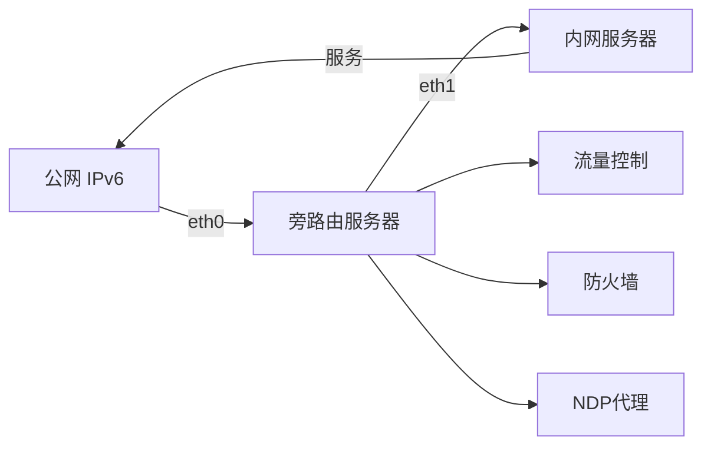

# 部署IPv6防DDoS旁路由系统

## 系统概述
本系统为基于Debian 13的IPv6防DDoS旁路由解决方案，提供：
- 时间感知带宽控制（白天3MB/s，晚上1MB/s）
- 每IP限速300kb/s
- IP请求频率限制（100次/分钟）
- 连接时长限制（1小时）
- 自适应封锁机制
- 详细流量日志记录
- 支持动态IPv6地址环境

## 系统要求
1. 硬件：双网口服务器（WAN口和LAN口）
2. 操作系统：Debian 13
3. 网络：
   - WAN口：连接互联网，获取动态IPv6地址
   - LAN口：连接内网服务器（固定IPv6地址）

## 网络拓扑


## 部署步骤

### 1. 系统初始化
```bash
# 更新系统
sudo apt update && sudo apt full-upgrade -y

# 安装必要组件
sudo apt install -y nftables conntrack ndppd rsyslog python3 \
    tcpdump tcptrack iftop iproute2 ipset
```

### 2. 网络配置
编辑网络配置文件 `/etc/network/interfaces`:
```bash
# WAN口 - 动态IPv6
auto eth0
iface eth0 inet6 auto
    accept_ra 2
    post-up sysctl -w net.ipv6.conf.eth0.proxy_ndp=1

# LAN口 - 固定IPv6
auto eth1
iface eth1 inet6 static
    address fd00::1
    netmask 64
```

应用网络配置：
```bash
sudo systemctl restart networking
```

### 3. 启用IPv6转发
编辑 `/etc/sysctl.conf`:
```conf
net.ipv6.conf.all.forwarding=1
net.ipv6.conf.default.forwarding=1
net.ipv6.conf.eth0.accept_ra=2
net.ipv6.conf.eth0.proxy_ndp=1
net.netfilter.nf_conntrack_max=2000000
net.ipv6.neigh.default.gc_thresh3=16384
```

应用配置：
```bash
sudo sysctl -p
```

### 4. 配置NDP代理
创建 `/etc/ndppd.conf`:
```conf
route-ttl 30000
proxy eth0 {
    router yes
    timeout 500
    ttl 30000
    rule fd00::/64 {
        static
    }
}
```

启动服务：
```bash
sudo systemctl enable ndppd
sudo systemctl start ndppd
```

### 5. 动态NDP更新脚本
创建 `/usr/local/bin/update-ndp.sh`:
```bash
#!/bin/bash

# 获取当前公网IPv6前缀
CURRENT_PREFIX=$(ip -6 addr show dev eth0 | grep inet6 | grep global | \
                awk '{print $2}' | cut -d: -f1-4 | head -1)

# 删除旧代理
ip -6 neigh flush proxy

# 为内网服务器添加代理（假设服务器地址为fd00::2）
ip -6 neigh add proxy fd00::2 dev eth0
ip -6 neigh add proxy ${CURRENT_PREFIX}::2 dev eth0

logger "NDP代理已更新: ${CURRENT_PREFIX}::2"
```

设置权限并创建定时任务：
```bash
sudo chmod +x /usr/local/bin/update-ndp.sh
(sudo crontab -l 2>/dev/null; echo "*/5 * * * * /usr/local/bin/update-ndp.sh") | sudo crontab -
```

### 6. 防火墙配置 (nftables)
创建 `/etc/nftables.conf`:
```nft
#!/usr/sbin/nft -f

flush ruleset

table ip6 ddos {
    set blacklist {
        type ipv6_addr
        flags timeout
        timeout 10m
    }
    
    set whitelist {
        type ipv6_addr
        elements = { fd00::/64 } # 内网地址白名单
    }
    
    # 流量计数器
    meter per_ip_counter {
        type ipv6_addr
        size 65535
    }
    
    meter global_counter {
        type ipv6_addr
        size 65535
    }
    
    chain input {
        type filter hook input priority 0; policy drop;
    }
    
    chain forward {
        type filter hook forward priority 0; policy accept;
        
        # 白名单直接放行
        ip6 saddr @whitelist accept
        
        # 黑名单检查
        ip6 saddr @blacklist counter drop
        
        # 单IP速率限制 (100次/分钟)
        add @per_ip_counter { ip6 saddr limit rate 100/minute burst 100 } \
            add @blacklist { ip6 saddr timeout 10m } drop
        
        # 全局速率限制 (1000次/分钟)
        add @global_counter { ip6 saddr limit rate 1000/minute } \
            jump lockdown_mode
        
        # 连接状态跟踪
        ct state established,related accept
        ct state invalid drop
        
        # 日志记录 (元数据)
        log prefix "FORWARD: " group 1
    }
    
    chain lockdown_mode {
        # 封闭模式处理 - 添加源IP到黑名单
        ip6 saddr != @whitelist add @blacklist { ip6 saddr timeout 10m } drop
        
        # 记录封锁事件
        log prefix "LOCKDOWN: " group 1
    }
}
```

启用防火墙规则：
```bash
sudo nft -f /etc/nftables.conf
```

### 7. 流量控制 (TC)
创建 `/usr/local/bin/tc-scheduler.sh`:
```bash
#!/bin/bash

# 清除现有规则
tc qdisc del dev eth0 root 2>/dev/null

# 创建HTB队列
tc qdisc add dev eth0 root handle 1: htb default 30

# 根据时间设置带宽
HOUR=$(date +%H)
if [ $HOUR -ge 8 ] && [ $HOUR -lt 20 ]; then
    RATE="3mbit"   # 白天3MB/s
    CEIL="3mbit"
else
    RATE="1mbit"   # 晚上1MB/s
    CEIL="1mbit"
fi

# 添加主类
tc class add dev eth0 parent 1: classid 1:1 htb rate $RATE ceil $CEIL

# 添加默认子类
tc class add dev eth0 parent 1:1 classid 1:10 htb rate 100kbit ceil 100kbit

# 每IP限速300kb/s
tc filter add dev eth0 parent 1: protocol ipv6 \
    u32 match ip6 src ::/0 flowid 1:10 \
    police rate 300kbit burst 10k drop

logger "流量控制已配置: $RATE (每IP 300kbit)"
```

设置权限并初始化：
```bash
sudo chmod +x /usr/local/bin/tc-scheduler.sh
sudo /usr/local/bin/tc-scheduler.sh
```

### 8. 连接时长监控
创建 `/usr/local/bin/conn-monitor.sh`:
```bash
#!/bin/bash

while true; do
    # 监控所有TCP连接
    conntrack -L -p tcp --state ESTABLISHED -o extended | while read conn; do
        src_ip=$(echo "$conn" | grep -oP 'src=\K[0-9a-f:]+')
        duration=$(echo "$conn" | grep -oP 'duration=\K\d+')
        
        # 如果连接持续时间超过1小时（3600秒）
        if [ "$duration" -gt 3600 ]; then
            # 添加到黑名单30分钟
            sudo nft add element ip6 ddos blacklist { $src_ip timeout 30m }
            logger "连接超时封锁: $src_ip (时长: ${duration}秒)"
        fi
    done
    sleep 60
done
```

设置权限：
```bash
sudo chmod +x /usr/local/bin/conn-monitor.sh
```

### 9. 自适应封锁管理系统
创建 `/usr/local/bin/block-manager.py`:
```python
#!/usr/bin/env python3

import time
import subprocess
import logging
import os

# 配置日志
logging.basicConfig(
    filename='/var/log/ddos_block.log',
    level=logging.INFO,
    format='%(asctime)s - %(levelname)s - %(message)s'
)

# 基础封锁时间（秒）
BASE_BLOCK = 600  # 10分钟
MAX_BLOCK = 86400  # 最大封锁时间（1天）

# 当前攻击计数
attack_count = 0
lock_file = "/var/lock/ddos.lock"

def get_connection_count():
    """获取当前TCP连接数"""
    try:
        result = subprocess.run(
            ['ss', '-6', '-t', '-H', '--no-header'],
            capture_output=True, text=True, check=True
        )
        return len(result.stdout.splitlines())
    except Exception as e:
        logging.error(f"获取连接数错误: {e}")
        return 0

def enter_lockdown(duration):
    """进入封锁模式"""
    try:
        # 创建封锁标记
        with open(lock_file, 'w') as f:
            f.write(str(duration))
        
        # 记录事件
        logging.warning(f"进入封锁模式! 时长: {duration}秒")
        
        # 等待封锁期结束
        time.sleep(duration)
        
        # 清除封锁标记
        if os.path.exists(lock_file):
            os.remove(lock_file)
        
        logging.info("封锁模式结束")
        
    except Exception as e:
        logging.error(f"封锁模式错误: {e}")

def main():
    global attack_count
    
    while True:
        conn_count = get_connection_count()
        
        # 检查是否已在封锁模式
        if os.path.exists(lock_file):
            time.sleep(30)
            continue
        
        # 如果连接数超过阈值（1000）
        if conn_count > 1000:
            attack_count += 1
            
            # 计算封锁时间（指数增长，但不超过最大值）
            block_time = min(BASE_BLOCK * (2 ** (attack_count - 1), MAX_BLOCK)
            
            # 进入封锁模式
            enter_lockdown(block_time)
            
            # 记录攻击事件
            logging.info(f"攻击 #{attack_count}: 连接数={conn_count}, 下次封锁时长={block_time}秒")
        else:
            # 没有攻击，重置计数
            if attack_count > 0:
                logging.info(f"攻击结束. 共检测到 {attack_count} 次攻击")
                attack_count = 0
            
            time.sleep(30)

if __name__ == "__main__":
    main()
```

设置权限：
```bash
sudo chmod +x /usr/local/bin/block-manager.py
```

### 10. 日志系统配置
创建 `/etc/rsyslog.d/ddos.conf`:
```conf
# 自定义日志设施
local1.* -/var/log/ddos.log

# 日志轮转
$ActionFileDefaultTemplate RSYSLOG_TraditionalFileFormat
$RepeatedMsgReduction off

# 自定义日志格式
$template DDoSLog,"%timegenerated% | %msg%\n"

# 应用模板
local1.* ?DDoSLog
```

创建日志轮转配置 `/etc/logrotate.d/ddos`:
```conf
/var/log/ddos.log {
    daily
    missingok
    rotate 30
    compress
    delaycompress
    notifempty
    sharedscripts
    postrotate
        /usr/lib/rsyslog/rsyslog-rotate
    endscript
}
```

重启日志服务：
```bash
sudo systemctl restart rsyslog
```

### 11. 系统服务配置
创建服务文件 `/etc/systemd/system/ddos-protect.service`:
```ini
[Unit]
Description=DDoS Protection System
After=network.target

[Service]
Type=simple
ExecStartPre=/usr/local/bin/tc-scheduler.sh
ExecStart=/usr/local/bin/block-manager.py
ExecStartPost=/usr/local/bin/conn-monitor.sh
Restart=always
RestartSec=10
StartLimitIntervalSec=60
StartLimitBurst=5

[Install]
WantedBy=multi-user.target
```

创建服务文件 `/etc/systemd/system/ndp-update.service`:
```ini
[Unit]
Description=Dynamic NDP Proxy Updater
After=network.target

[Service]
Type=oneshot
ExecStart=/usr/local/bin/update-ndp.sh

[Install]
WantedBy=multi-user.target
```

创建定时器 `/etc/systemd/system/ndp-update.timer`:
```ini
[Unit]
Description=Update NDP Proxy every 5 minutes

[Timer]
OnBootSec=5min
OnUnitActiveSec=5min

[Install]
WantedBy=timers.target
```

启用并启动服务：
```bash
sudo systemctl daemon-reload
sudo systemctl enable ddos-protect ndp-update.timer
sudo systemctl start ddos-protect
sudo systemctl start ndp-update.timer
```

### 12. 时间策略切换
创建每日切换任务：
```bash
sudo tee /etc/cron.d/traffic-schedule <<EOF
0 8 * * * root /usr/local/bin/tc-scheduler.sh day
0 20 * * * root /usr/local/bin/tc-scheduler.sh night
EOF
```

更新 `tc-scheduler.sh` 支持参数：
```bash
# 在脚本顶部添加参数处理
if [ "$1" = "day" ]; then
    RATE="3mbit"
    CEIL="3mbit"
elif [ "$1" = "night" ]; then
    RATE="1mbit"
    CEIL="1mbit"
else
    # 原有自动检测代码
    HOUR=$(date +%H)
    if [ $HOUR -ge 8 ] && [ $HOUR -lt 20 ]; then
        RATE="3mbit"
        CEIL="3mbit"
    else
        RATE="1mbit"
        CEIL="1mbit"
    fi
fi
```

## 系统验证与监控

### 基本检查
```bash
# 检查服务状态
sudo systemctl status ddos-protect ndp-update.timer

# 查看当前封锁列表
sudo nft list set ip6 ddos blacklist

# 检查流量控制
sudo tc -s qdisc show dev eth0
```

### 连接监控
```bash
# 实时连接监控
sudo conntrack -E

# 带宽监控
sudo nload -u M -i 1000000 -o 1000000 eth0
```

### 日志查看
```bash
# 查看DDoS事件日志
sudo tail -f /var/log/ddos.log

# 查看封锁管理日志
sudo tail -f /var/log/ddos_block.log
```

### 压力测试
```bash
# 安装测试工具
sudo apt install -y siege

# 测试内网服务器（替换为实际IPv6地址）
siege -6 -c 150 -t 1M http://[fd00::2]
```

## 维护与优化

### 定期维护任务
```bash
# 每周清理旧日志
sudo tee /etc/cron.weekly/ddos-cleanup <<EOF
#!/bin/bash
find /var/log -name "ddos*.log*" -mtime +30 -delete
nft list ruleset > /etc/nftables.backup
EOF
sudo chmod +x /etc/cron.weekly/ddos-cleanup
```

### 性能优化
编辑 `/etc/sysctl.conf` 添加：
```conf
# 连接跟踪优化
net.netfilter.nf_conntrack_tcp_timeout_established = 1200
net.netfilter.nf_conntrack_max = 2000000

# 网络栈优化
net.core.netdev_max_backlog = 100000
net.core.somaxconn = 65535
net.ipv4.tcp_max_syn_backlog = 65535
```

### 备份与恢复
```bash
# 备份防火墙规则
sudo nft list ruleset > /etc/nftables.backup

# 恢复规则
sudo nft -f /etc/nftables.backup

# 备份流量控制配置
sudo tc qdisc show dev eth0 > /etc/tc-config.backup
```

## 故障排除

### NDP代理不工作
```bash
# 手动更新代理
sudo /usr/local/bin/update-ndp.sh

# 查看代理表
ip -6 neigh show proxy

# 检查NDPPD服务
sudo systemctl status ndppd
```

### 限速未生效
```bash
# 检查TC配置
sudo tc -s qdisc show dev eth0
sudo tc class show dev eth0

# 检查nftables计数器
sudo nft list meter ip6 ddos per_ip_counter
```

### 连接跟踪问题
```bash
# 查看当前连接
sudo conntrack -L

# 调整内核参数
sudo sysctl -w net.netfilter.nf_conntrack_tcp_be_liberal=1
```

## 注意事项
1. **动态IPv6处理**：系统每5分钟更新NDP代理，确保内网服务器可达
2. **初始阈值设置**：部署初期建议提高阈值避免误封
3. **监控系统**：定期检查系统资源使用情况
4. **安全更新**：保持系统最新安全补丁
5. **灾难恢复**：定期备份关键配置文件

本系统提供了全面的IPv6 DDoS防护功能，通过旁路由模式保护内网服务器，同时支持动态IPv6环境。系统设计考虑了自动化运维和性能优化，适合长期稳定运行。
